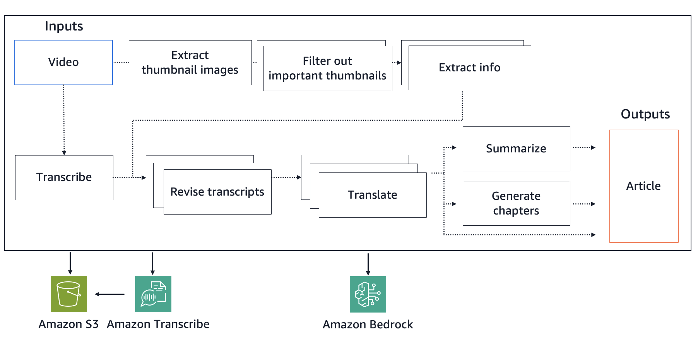

# Video2Article - Multi-lingual Video Transcription Sample using Amazon Bedrock

This is a practical sample application using Amazon Bedrock that leverages Generative AI to make existing presentation videos more efficiently usable across language barriers. 

When a presentation video is input, the application transcribes the presentation content and outputs it as a PDF file in the specified language. 

By using this application, users can review content more efficiently than watching videos, and it also makes it easier to expand video content in one language to other language regions.

## Usage

1. Setup AWS credentials and configuration
    * This sample uses AWS credentials in your local environment to access AWS services. 
    * It uses the current credentials displayed by the `aws configure list` command, so if they are not displayed correctly, please specify `AWS_ACCESS_KEY_ID`, `AWS_SECRET_ACCESS_KEY`, (`AWS_SESSION_TOKEN`), or `AWS_PROFILE`.
    * This sample calls the following APIs: bedrock:InvokeModel, transcribe:startTranscriptionJob, getTranscriptionJob, s3: PutObject, GetObject, DeleteObject.
2. Setup Amazon Bedrock
    * In the `us-west-2` region, enable model access for Anthropic Claude 3 Haiku, 3.5 Sonnet (v2), 3.7 Sonnet on Amazon Bedrock. (https://docs.aws.amazon.com/bedrock/latest/userguide/model-access-modify.html)
3. Create an S3 bucket
    * Create an S3 bucket in `us-west-2` region for Amazon Transcribe to temporarily store audio files.
4. Place a video file
    * Create a `data/input/` folder and place the mp4 video file as `data/input/xxxx.mp4`
5. Copy and modify a script file
    * Copy `scripts/run-script.sample.sh` to `scripts/run-script.sh` and edit variables to match your task and environment (VIDEO_TITLE, VIDEO_PATH, TRANSCRIBE_S3_BUCKET, TARGET_LANGUAGE).
6. (Optional) Make the script executable:  
   `chmod +x scripts/run-script.sh`
7. Run the script:  
   `./scripts/run-script.sh`
8. Check the result
    * The output PDF will be placed in `data/output/{date}-{input file name}/{date}-{input file name}.pdf`



## Customization

You can change the number of parallel workers (`max_workers`) and the model (`model_id`) for each processing step by editing `config.yaml`.

```yaml
processors:
  transcript_revisor:
    revise:
      max_workers: 30  # Specify the number of parallel workers
      model_id: "us.anthropic.claude-3-7-sonnet-20250219-v1:0"  # Specify the model ID to use
```

# Security

See [CONTRIBUTING](CONTRIBUTING.md#security-issue-notifications) for more information.

## License

This library is licensed under the MIT-0 License. See the LICENSE file.

